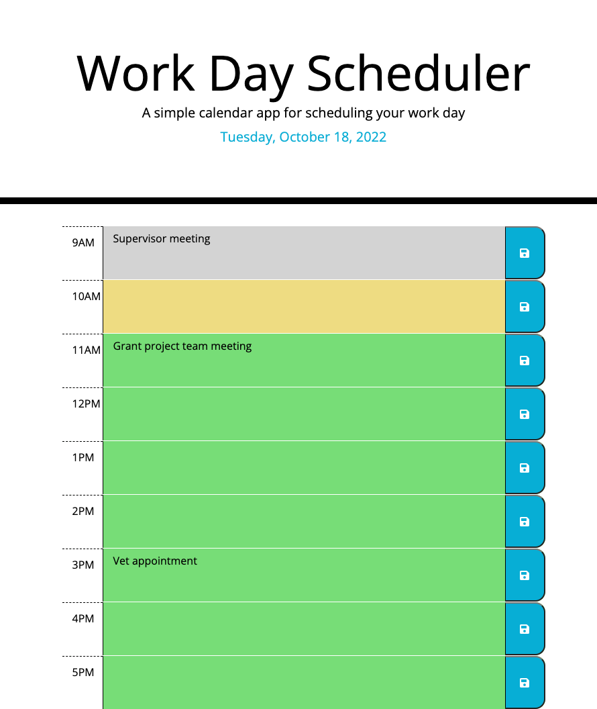

# Module 5 Challenge: Third-Party APIs - Work Day Scheduler

## Assignment

By modifying starter code, create a simple calendar application using HTML and CSS powered by jQuery to allow a user to save events for each hour of the day.

## User Story

AS AN employee with a busy schedule
I WANT to add important events to a daily planner
SO THAT I can manage my time effectively

## Acceptance Criteria

GIVEN I am using a daily planner to create a schedule
WHEN I open the planner
THEN the current day is displayed at the top of the calendar
WHEN I scroll down
THEN I am presented with time blocks for standard business hours
WHEN I view the time blocks for that day
THEN each time block is color coded to indicate whether it is in the past, present, or future
WHEN I click into a time block
THEN I can enter an event
WHEN I click the save button for that timeb lock
THEN the text for that event is saved in local storage
WHEN I refresh the page
THEN the saved events persist

## Screenshot

## Deployed Application

https://shawnawhite3699.github.io/work-day-scheduler/